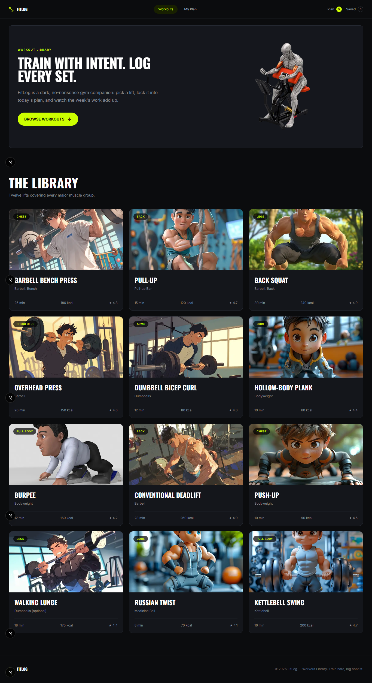
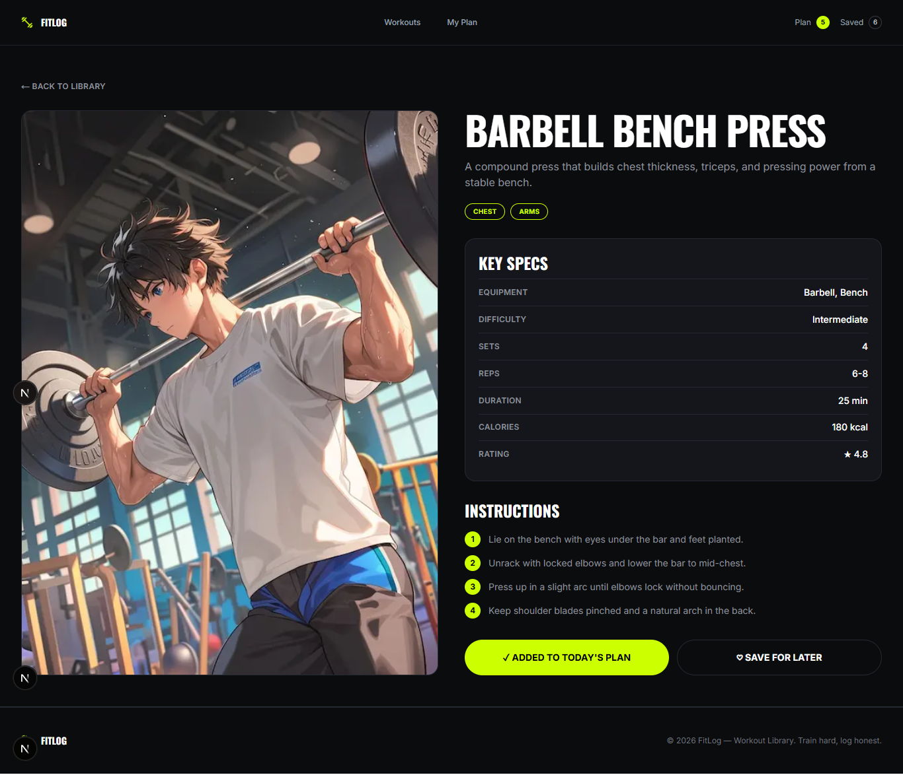
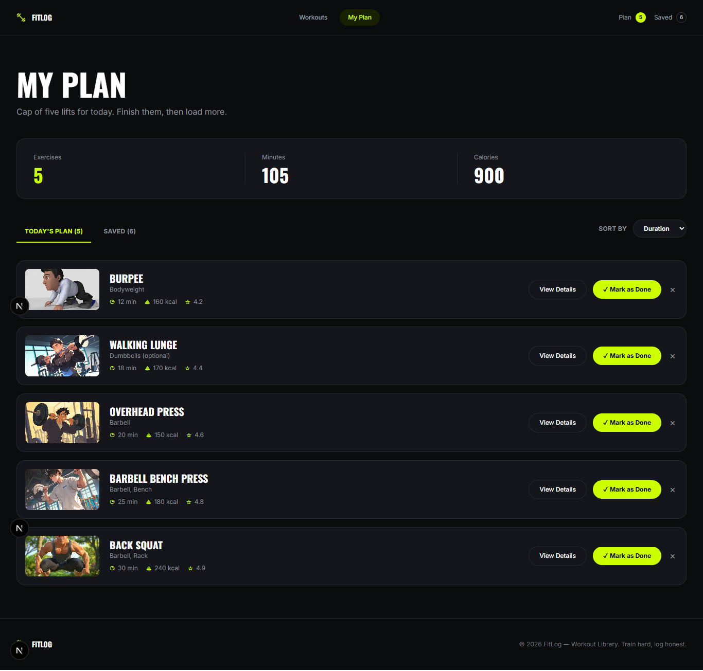

# FITLOG

### Train with intent. Log every set.

FitLog is a modern workout library and personal workout planning application built with **Next.js**. Users can browse workouts, view detailed exercise information, add workouts to their daily plan, save workouts for later, and manage their workout list from one place.

---

## 🔗 Live Demo

**Live Website:** 

---

## 🖼️ Preview

<table>
  <tr>
    <td width="50%" rowspan="2" align="center">
      
      <br>
      <b>Home Page</b>
    </td>
    <td width="50%" align="center">
      
      <br>
      <b>Workout Details</b>
    </td>
  </tr>
  <tr>
    <td width="50%" align="center">
      
      <br>
      <b>My Plan</b>
    </td>
  </tr>
</table>


---

## 📖 About the Project

FitLog is designed to make workout planning simple and focused.

The application provides a workout library with detailed exercise information, a personal plan for today's workouts, and a saved workout section for exercises users want to come back to later.

Workout data is fetched from the provided FitLog API, while plan and saved workout selections are persisted using browser `localStorage`.

---

## ✨ Features

* **Workout Library** — Browse all available workouts in a responsive grid.
* **Workout Details** — View equipment, difficulty, sets, reps, duration, calories, rating, description, and instructions.
* **My Plan** — Add workouts to today's plan and track total exercises, minutes, and calories.
* **Save for Later** — Save workouts for quick access later.
* **Sorting** — Sort workouts by duration, calories, or rating.
* **Persistent Data** — Plan and saved workouts remain available after refreshing the page.
* **Workout Management** — Mark workouts as done or remove them from your plan.
* **Responsive Design** — Optimized for mobile, tablet, and desktop screens.
* **Custom 404 Page** — Displays a custom page when an invalid route is accessed.

---

## 🛠️ Technologies Used

* **Next.js**
* **React**
* **TypeScript**
* **Tailwind CSS**
* **React Context API**
* **Browser Local Storage**
* **REST API**

---

## 🔌 API

FitLog uses the provided workout API.

### All Workouts

```text
https://api.abcz.workers.dev/api/fitlog
```

### Single Workout

```text
https://api.abcz.workers.dev/api/fitlog/:id
```

The application fetches the workout library from the API and retrieves individual workout details through the dynamic workout route.

---

## 📁 Project Structure

```text
src/
├── app/
│   ├── globals.css
│   ├── layout.tsx
│   ├── page.tsx
│   ├── not-found.tsx
│   ├── my-plan/
│   │   └── page.tsx
│   └── workouts/
│       └── [id]/
│           └── page.tsx
│
├── components/
│   ├── homepage/
│   │   ├── Banner.tsx
│   │   └── Library.tsx
│   │
│   ├── shared/
│   │   ├── Navbar.tsx
│   │   └── Footer.tsx
│   │
│   └── workout/
│       └── WorkoutActions.tsx
│
├── context/
│   └── FitLogContext.tsx
│
├── types/
│   └── workout.ts
│
└── assets/
    ├── banner.png
    └── logo.png
```

---

## 🚀 Getting Started

### Clone the Repository

```bash
git clone https://github.com/FZ-Fahim/PH-Assignment01.git
```

### Open the Project

Navigate to the project folder:

```bash
cd PH-Assignment01
```

### Install Dependencies

```bash
npm install
```

### Run the Development Server

```bash
npm run dev
```

Open the application in your browser:

```text
http://localhost:3000
```

---

## 🏗️ Build for Production

Create a production build:

```bash
npm run build
```

Start the production server:

```bash
npm start
```

---

## 🎯 Assignment Objective

The objective of this assignment was to build a responsive workout library and workout planning application using **Next.js**, based on the provided design and project requirements.

The project focuses on component-based development, API integration, responsive UI design, client-side state management, and persistent data using browser local storage.

---

## 👨‍💻 Author

**Ferdous Zaman**

**GitHub:**
https://github.com/FZ-Fahim

---

## ⭐ Acknowledgements

* Design and requirements provided as part of the **Learning assignment**.
* Workout data provided through the **FitLog API**.
* Built for educational purposes using Next.js and modern web development technologies.
